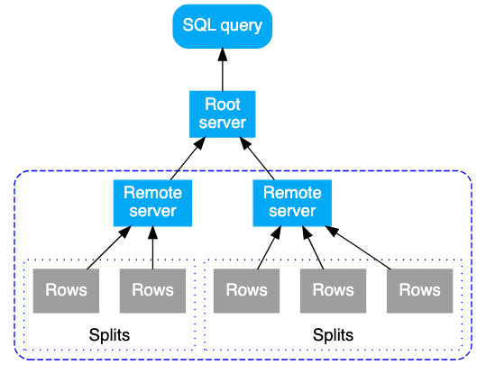

# 6 Create and Manage Cloud Spanner Instances

1. Create spanner instance and database.
2. Create table with DDL query.
3. Load data with Dataflow or DML query.
4. Explore spanner studio in console.

## Life of Query in Spanner
SQL query is sent to an initial root server and the root server waits results from the remote executions. 
- Query execution flows: from top to bottom
- Query results: from bottom to top.

## Query Execution Operators

https://cloud.google.com/spanner/docs/query-execution-operators
