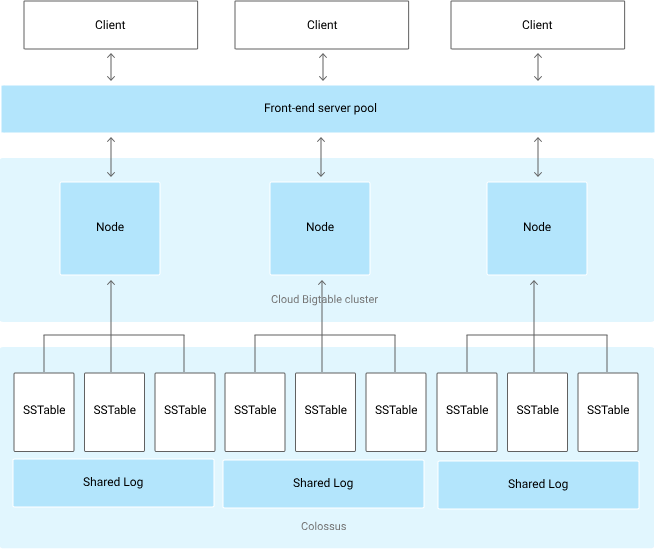

# 7 Create and Manage BigTable Instances

1. Create bigtable instance and cluster.
2. Create table and column family with `cbt` tool.
3. Load data with dataflow job.
4. Read from a single row.
5. Enable replication by adding cluster.
6. Create backup and restore.


## BigTable Architecture
Bigtable table is shared into blocks of contiguous rows, called tablets. Tablets are stored in SSTable format which provides a persistent, ordered immutable map from keys to values.

- Row key
- Column family




## `cbt` CLI
```
cbt createtable TableName
cbt createfamily TableName familyname # create column family
cbt lookup TableName row#key # read from single row
cbt read TableName prefix=pre count=10 # read 10 rows with prefix pre in row key
```
