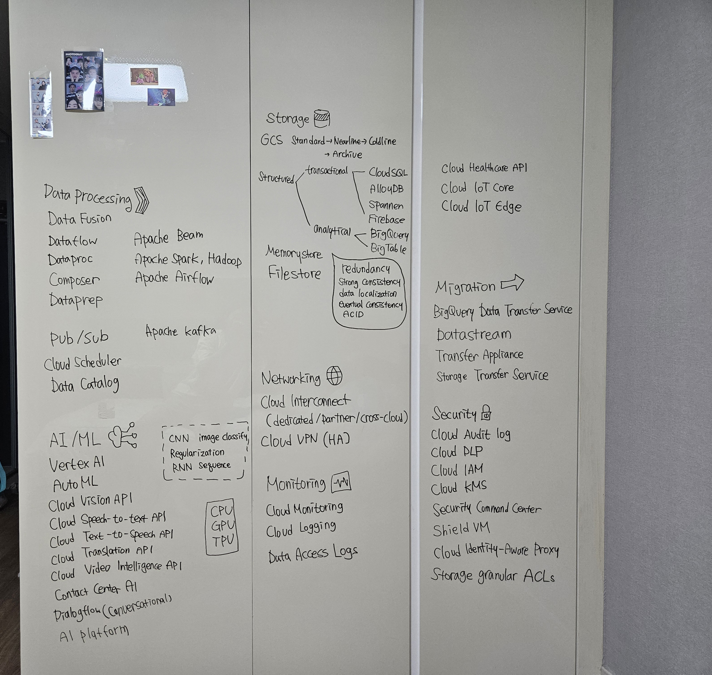

# Professional Data Engineer

> Code storage for Google Cloud’s Professional Data Engineer learning path

## Overview
A **Professional Data Engineer** makes data usable and valuable for others by collecting, transforming, and publishing data. This individual evaluates and selects products and services to meet business and regulatory requirements. A Professional Data Engineer creates and manages robust data processing systems. This includes the ability to design, build, deploy, monitor, maintain, and secure data processing workloads.

[🔗 SEONGHYEON KOO](https://www.cloudskillsboost.google/public_profiles/a393f4b2-8117-48cc-a4bb-c128ab858080)

## Roadmap

